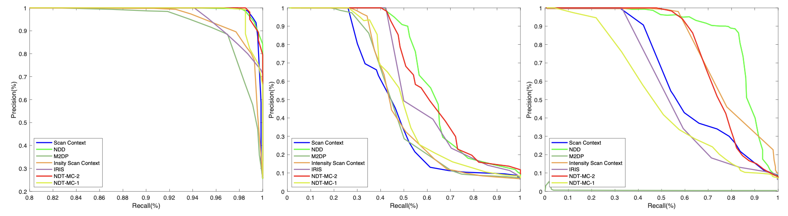

# NDTMC
A 3D Global Descriptor For Loop Closure Detection

# Example
- We implemented the SLAM package of NDTMC and LIOSAM integration, which can be found at [NDTMC-LIO-SAM](https://github.com/SlamCabbage/NDTMC-LIO-SAM).

- We tested our descriptor on KITTI sequences 00, 02, 05, 06, 07 and 08:

<p align="center">

<p align="center">

# How to use

1. Create GT of LCD

    Use script/create_ground_truth.py to generate the LCD GT value, you need to modify the two file paths in the script/create_ground_truth.py (odometry ground truth file path, LCD GT value result path).

2. Save descriptors

    Modify the main function in run_demo.cpp as follow:

    ```
    int main(int argc, char **argv)
    {
        saveDesc(argv);
        // matchForKitti(argv);
        // matchForNIO(argv);
        return 0;
    }

    ```

    Build and run script/auto_test.py to generate descriptors, where input_folder and output_folder need to be modified to the voledyne folder path of the currently processed sequence and the folder path where you want to save the descriptor results, respectively.

3. Descriptors matching

    Modify the main function in run_demo.cpp as follow:

    ```
    int main(int argc, char **argv)
    {
        // saveDesc(argv);
        matchForKitti(argv);
        // matchForNIO(argv);
        return 0;
    }

    ```

    Build and run script/auto_match.py to perform descriptor matching, where input_folder and output_txt need to be modified to the folder path where the descriptor was saved in the previous step and the txt file path where you want to save the matching result, respectively.

At this point, you can get the matching result of each frame, and you can process it yourself to get more result information, such as: precision-recall curve, F1 Score and Extended Precision.

# Cite NDTMC
```
@inproceedings { 
    comming soon.
}
```

## Contact
- Maintainer: Lizhou Liao (`liaolizhou@icloud.com`)
#### Contributors
- Lizhou Liao: completed the code

## Acknowledgement
  - Thanks for NIO low-speed localization and mapping group.
